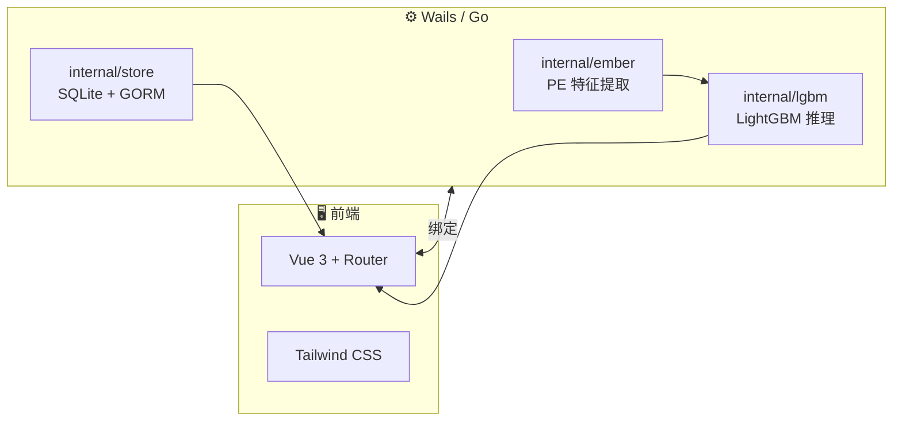

<div align="center">

# 🛡️ XSCAN 机器学习 ·  恶意软件扫描客户端

**基于 [Wails](https://wails.io/) 的 Windows 桌面客户端** · Go 后端提取 **Ember 风格** PE 特征 · 纯 Go **LightGBM** 推理（[`leaves`](https://github.com/dmitryikh/leaves)）  
**Vue 3 + Vite + Tailwind** 现代化界面 · 本地 **SQLite** 历史记录与配置

[](https://go.dev/)
[](https://vuejs.org/)
[](https://wails.io/)

</div>

---

## 📖 目录

- [✨ 功能一览](#-功能一览)
- [🏗️ 架构与技术栈](#️-架构与技术栈)
- [📁 仓库结构](#-仓库结构)
- [🧰 环境准备](#-环境准备)
- [🚀 开发与打包](#-开发与打包)
- [🧠 模型与 Ember 数据集](#-模型与-ember-数据集)
- [🔬 训练与 Python 侧（可选）](#-训练与-python-侧可选)
- [🧪 特征对齐调试](#-特征对齐调试)
- [📤 推送到 GitHub](#-推送到-github)
- [🔁 日常维护与更新](#-日常维护与更新)
- [📦 Release 发布建议](#-release-发布建议)
- [⚠️ 免责声明](#️-免责声明)

---

## ✨ 功能一览

| | |
|--|--|
| 🔍 | **本地 PE 扫描**：选择文件，提取与训练管线一致的 Ember 兼容特征向量 |
| 📊 | **双引擎策略**：支持 **2018 / 2024** 两套 LightGBM 模型路径与独立阈值（可在设置中配置） |
| 💾 | **扫描历史**：SQLite 持久化，便于回顾与统计 |
| 🌐 | **界面语言**：内置中英文切换 |
| 🎛️ | **无边框窗口**：现代化桌面体验（WebView2） |

> 💡 客户端**不包含**官方 Ember 原始数据集或预训练模型文件；你需要自行准备符合特征维度的 **LightGBM 文本模型**（`.txt`），并在「设置」中指定路径。

---

## 🏗️ 架构与技术栈



| 层级 | 主要依赖 |
|------|-----------|
| 桌面壳 | [Wails v2](https://wails.io/) · Windows WebView2 |
| 后端 | Go（见 `xscan_client/go.mod`，当前声明 **Go 1.25.0**） |
| 机器学习 | [`github.com/dmitryikh/leaves`](https://github.com/dmitryikh/leaves) 加载 LightGBM **文本格式**模型 |
| PE 解析 | [`github.com/saferwall/pe`](https://github.com/saferwall/pe) 等 |
| 前端 | Vue 3 · Vite · TypeScript · Tailwind · Lucide 图标 |

特征维度与 Python 侧 `go_server/ember_cert/features.py` 中 `PEFeatureExtractor` 顺序对齐（约 **2568** 维，见 `xscan_client/internal/ember/dims.go`）。

---

## 📁 仓库结构

```
XSCAN_GOGUI/
├── xscan_client/          # 🎯 主程序：Wails 桌面客户端（从这里构建）
│   ├── frontend/          # Vue 源码（npm build → dist）
│   ├── internal/
│   │   ├── ember/         # PE 特征（Ember 风格）
│   │   ├── lgbm/          # 模型加载与推理池
│   │   ├── store/         # SQLite 配置与历史
│   │   └── pemeta/        # 签名等元数据
│   ├── cmd/featuredump/   # CLI：导出 Go 特征 JSON（调试）
│   ├── main.go / app.go
│   └── wails.json
├── go_server/             # 🐍 训练与数据处理（LightGBM / sklearn 等）
│   ├── ember_cert/        # 含证书相关特征的训练代码
│   └── ember_nocert/
├── dump_python_features.py   # 从 Python 导出特征 JSON
├── compare_features.py       # 对比 Python vs Go 特征是否一致
└── README.md                 # 本文件
```

---

## 🧰 环境准备

在 **Windows** 上开发本客户端时，建议安装：

1. **Go**：版本不低于 `xscan_client/go.mod` 中的要求（当前为 `go 1.25.0`；若本地仅有 1.22/1.23，需升级 Go 或按需下调 `go` 版本行并验证构建）。
2. **Node.js**：建议 **18+**（与 Vite/Vue 工具链兼容）。
3. **Wails CLI**：安装方式见 [Wails 官方文档](https://wails.io/docs/gettingstarted/installation)。
4. **WebView2 运行时**：Windows 10/11 通常已自带；若缺失，按微软指引安装 **Evergreen Runtime**。

进入客户端目录：

```powershell
cd xscan_client
```

安装前端依赖（首次或依赖变更后）：

```powershell
cd frontend
npm install
cd ..
```

---

## 🚀 开发与打包

### 热重载开发

在 `xscan_client` 目录：

```powershell
wails dev
```

前端默认由 Vite 提供；Go 侧变更会触发 Wails 重新编译。

### 生产构建

先确保前端已构建（`wails build` 通常会调用 `wails.json` 里的 `frontend:build`，但本地可先手动验证）：

```powershell
cd frontend
npm run build
cd ..
wails build
```

产物一般在 `xscan_client/build/bin/`（具体以 Wails 输出为准）。  
`xscan_client/.gitignore` 已忽略 `build/bin`、`node_modules`、`frontend/dist`，**不要将巨型构建产物误提交到 Git**。

---

## 🧠 模型与 Ember 数据集

### 要不要 Fork Ember 官方仓库？🍴

**一般不需要。**

| 场景 | 建议 |
|------|------|
| **只做毕业设计 / 使用本客户端扫描** | ❌ 不必 Fork。准备好与你训练时一致的 **LightGBM 模型文件**即可。 |
| **要重新训练模型** | 从 **Elastic ENDGAME Ember** 官方渠道**下载数据集**（遵守其许可证），在本地或服务器解压使用即可；无需 Fork 也能完成训练。 |
| **你要改 Ember 上游代码、长期协作或提 PR** | ✅ 此时再 **Fork** 官方仓库到自己的 GitHub，便于分支管理与合并。 |

总结：**Fork 是协作与定制上游的手段，不是运行本客户端的前置条件。**

### 客户端侧你需要什么？📎

- 两个（或一个）**LightGBM 文本模型**路径，例如你在 Python 中 `lgb.Booster.save_model(...)` 导出的格式，确保与 `leaves` 兼容。
- 在应用 **设置** 页配置 **2018 / 2024** 模型路径与 **阈值**；数据库与可执行文件同目录附近的逻辑见 `app.go` 中 `store.OpenDatabase`。

数据集体积很大，**请勿**将整个 Ember 原始数据 push 到 GitHub；可用 `.gitignore` 忽略数据目录，在 README 或 Release 说明里写「数据从何处下载」。

---

## 🔬 训练与 Python 侧（可选）

目录 `go_server/` 用于特征与训练流程（如 `ember_cert/model.py`）。典型步骤：

```powershell
cd go_server
python -m venv .venv
.\.venv\Scripts\Activate.ps1
pip install -r requirements.txt
# 若 model.py 还依赖 polars 等，请按报错补装：pip install polars
```

具体训练命令取决于你的数据路径与脚本入口，需与你的 **标签与特征文件格式** 一致；训练完成后导出 **与客户端特征维度一致** 的 LightGBM 模型供 Wails 客户端加载。

---

## 🧪 特征对齐调试

确保 Go 与 Python 提取同一 PE 时向量一致，可用仓库根目录脚本：

1. **Python 特征**（避免导入整个包时拉起重依赖时，脚本已按需加载 `features.py`）：

   ```powershell
   python dump_python_features.py --path C:\path\to\sample.exe -o python_features.json
   ```

2. **Go 特征**（在仓库根目录，需已安装 Go 模块依赖）：

   ```powershell
   cd xscan_client
   go run ./cmd/featuredump -path C:\path\to\sample.exe -o ..\go_features.json
   cd ..
   ```

3. **对比**（默认读取当前目录下两个 JSON）：

   ```powershell
   python compare_features.py --py python_features.json --go go_features.json
   ```

证书相关特征可用 Go 侧 `-cert` 开关（见 `cmd/featuredump/main.go`）。

---

## 📤 推送到 GitHub

若本地尚未初始化 Git（当前仓库根目录可能没有 `.git`），可按下面做一次。

### 1️⃣ 在 GitHub 网页新建仓库

- 登录 [GitHub](https://github.com) → **New repository**。  
- 建议：**不要**勾选「用 README 初始化」（避免首次推送冲突）。  
- 记下远程地址，例如 `https://github.com/<你的用户名>/XSCAN.git`。

### 2️⃣ 本地初始化并首次推送

在 **`XSCAN_GOGUI` 根目录**执行（按你的邮箱/用户名修改）：

```powershell
git init
git branch -M main

# 建议：添加根目录 .gitignore，忽略 Python 虚拟环境、大块数据等（示例）
# .venv/
# go_server/.venv/
# *.exe
# *.zip
# data/

git add .
git status   # 确认没有 node_modules、build/bin、数据集等大文件
git commit -m "Initial commit: XSCAN Wails PE scanner client"

git remote add origin https://github.com/<你的用户名>/XSCAN.git
git push -u origin main
```

若使用 **SSH**：

```powershell
git remote add origin git@github.com:<你的用户名>/XSCAN.git
git push -u origin main
```

### 3️⃣ 认证提示

- HTTPS：可能需要 **Personal Access Token**（代替密码）。  
- SSH：需在本机生成密钥并在 GitHub → Settings → SSH keys 中添加。

---

## 🔁 日常维护与更新

推荐养成固定小流程：

1. **开分支改功能**：`git checkout -b feat/xxx` 或 `fix/xxx`。  
2. **小步提交**：`git add -p` 审查差异，`git commit -m "描述清楚的一句话"`。  
3. **同步上游（若你 Fork 了别人的仓库）**：
   ```powershell
   git remote add upstream <原作者仓库 URL>   # 只需一次
   git fetch upstream
   git checkout main
   git merge upstream/main
   ```
4. **推送到你的 GitHub**：`git push origin main`（或推分支后提 **Pull Request**）。  
5. **依赖升级**：Go 用 `go get -u ./...` 谨慎升级并测试；前端在 `frontend` 目录 `npm outdated` / `npm update`。  
6. **发版前**：跑一遍 `wails build`，在干净机器或虚拟机 smoke test。

---

## 📦 Release 发布建议

GitHub **Releases** 适合分发**已编译安装包**，而不是把整个数据集放进去。

### 推荐流程

1. **更新版本号**：可在 `frontend/package.json` 的 `version`、或 Release 说明中写明「对应 commit / tag」。  
2. **打标签**（语义化版本，示例 `v1.0.0`）：
   ```powershell
   git tag -a v1.0.0 -m "First stable release"
   git push origin v1.0.0
   ```
3. 在 GitHub 仓库页 → **Releases** → **Draft a new release**：
   - **Choose a tag**：选中 `v1.0.0`。  
   - **Release title**：如 `v1.0.0`。  
   - **Describe**：列举功能、修复、已知问题、**模型文件需单独获取**等。  
4. **上传附件**：将 `wails build` 生成的 `.exe`（或 zip 安装包）拖到 Assets。  
5. 如需 **自动构建**，可后续加 **GitHub Actions**（在 Windows runner 上安装 Go、Node、Wails 并 `wails build`），属于进阶话题。

### 不要放进 Release 的东西 ❌

- Ember 全量原始数据、未脱敏私有样本。  
- 含密钥或个人信息的数据库文件。

---

## ⚠️ 免责声明

本工具用于 **安全研究与教学**。用户需确保在 **合法授权** 范围内对样本进行分析；开发者不对滥用行为负责。Ember 数据集与第三方库版权归各自权利人所有，使用前请阅读其 **许可证**。

---

<div align="center">
**祝你顺利 🎓 · Star 一下仓库下次更好找 ⭐**

Made with 💙 for graduation project **XSCAN_GOGUI**

</div>
